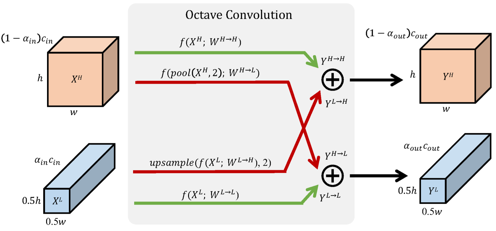

# Octave Convolution

PyTorch implementation and a breif explanation of Octave convolution from https://arxiv.org/pdf/1904.05049.pdf. 

Octave convolution can be used as a replacement for vanilla convolution. It has been demonstrated by the authors that similar (sometimes better) accuracy can be achieved using octave convolution while saving a huge number of flops required. Model size in case of octave and vanilla convolutions is same. 

Vanilla convolution carries out high frequency convolution throughout all the inputs channels. Octave convolution on the other hand, partitions all channels into two parts: high frequency and low frequency. Low frequency channels are one octave smaller (height and width) compared to high frequency convolutions. Moreover, high and low frequency channels are combined with each other before sending out the outputs.  

As can be seen in the figure, each octave convolution module can have upto 4 branches inside it each doing vanilla convolution. The paths with green color, donot change the spatial dimensions going from input to output. However, the paths with red color either increase (Low-to-high) or decrease (High-to-low) the spatial dimensions going from input to output. 

When going from high frequency input to low frequency output (HtoL path), a 2x2 pooling operation is done to get the downscaled input for convolution. So, the HtoL path is `conv_vanilla(pool(in_high))`

Similarly when going from Low Frequency input to high frequency output (LtoH path), a vanilla convolution is topped with a bilinear interpolation to upsample the low resolution conv output. So, the LtoH path is `bilenear_interpolation(vanilla_convolution(in_low))`.

At the heart of Octave convolution lies the concept of $\alpha$ (ratio of the total channels which are used by low frequency convolutions). For the first convolution layer, there is no low frequency input channel, so $\alpha_{in} = 0$.

Similarly for the last convolution layer, there is no low frequency output channel, $\alpha_{out} = 0$. For all the other layers, the authors assumed $\alpha_{in} = \alpha_{out} = 0$.   

For testing this implementation, I trained a vanilla 2 layer convolutional network on CIFAR10 for some 20 epochs. Then I replaced all convolutions with Octave convolution. the network performed slightly better (2-3%). I feel, for bigger networks the difference might be even better. 

Detailed explanation of the codes can be found at my blog: [my blog](https://amohant4.github.io/2019/05/13/OctaveConv.html)

